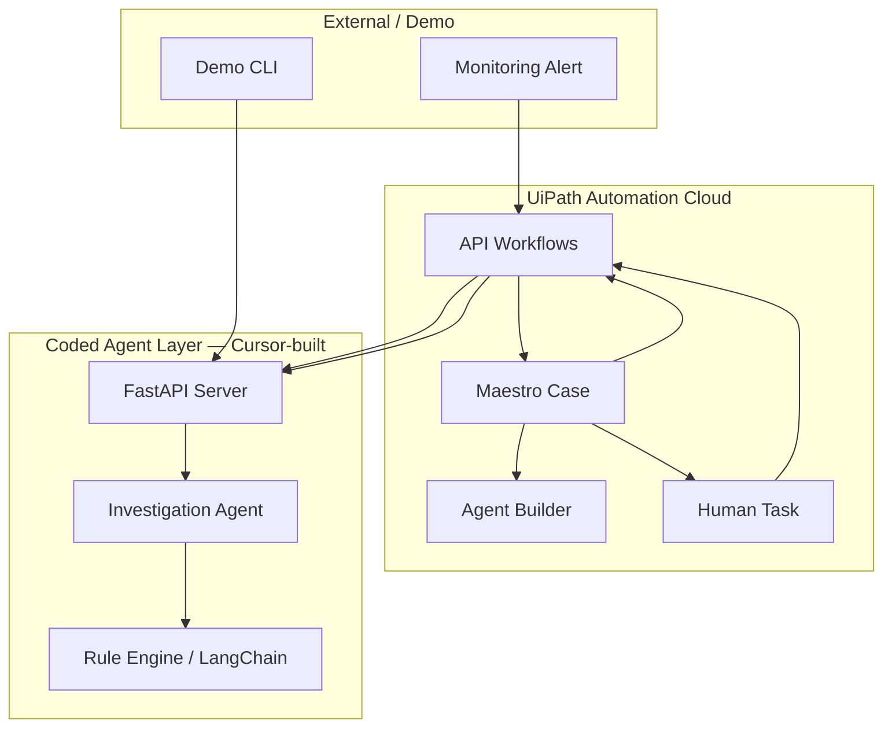

# Architecture

## Design principles

1. **UiPath is the orchestration layer** — Maestro Case owns lifecycle, SLAs, human tasks, and audit.
2. **Coded agents do deep analysis** — Python + LangChain handles log correlation and RCA.
3. **Humans approve before action** — No autonomous remediation without explicit SRE approval.
4. **Demo-first** — Three realistic incidents run end-to-end without production infrastructure.

## Component diagram



## Case lifecycle

| Stage | Actor | Output |
|---|---|---|
| Triage | Agent Builder / API | Severity, priority, blast radius |
| Investigate | Coded agent (Python) | Root cause, confidence, recommended action |
| Await Approval | Human (SRE) | Approve or reject |
| Remediate | API Workflow | Executed action + timestamp |
| Verify | API Workflow | Health check confirmation |
| Closed | Maestro | Full audit timeline |

## Investigation agent

Two modes:

### Rule-based (default, no API key)

Pattern-matches error signatures and log lines against known incident types. Returns high-confidence RCA for the three demo scenarios.

### LangChain + OpenAI (optional)

When `OPENAI_API_KEY` is set, sends alert context + logs to `gpt-4o-mini` with structured output parsing. Falls back to rule-based on error.

Built with **Cursor** — see `agents/investigation_agent.py`.

## Data flow

```
POST /webhooks/alert
  → triage_alert()
  → CaseRecord created (stage: INVESTIGATE)
  → optional forward to UIPATH_WEBHOOK_URL

POST /agents/investigate
  → investigate(InvestigationRequest)
  → case.investigation updated
  → stage → AWAIT_APPROVAL

POST /remediation/execute
  → mock remediation
  → case.remediation updated
  → stage → CLOSED
  → timeline events appended
```

## Security notes (production considerations)

- Authenticate webhooks (HMAC signature from PagerDuty/Datadog)
- Restrict remediation allowlist server-side
- Store cases in UiPath, not in-memory (demo uses in-memory dict)
- Rotate service tokens via vault integration

## Extending the project

- Add real PagerDuty/Datadog webhook parsers
- Connect remediation to Kubernetes API or AWS ECS
- Use UiPath Test Cloud to validate automation after remediation
- Add Slack/Teams notifications on human approval tasks
